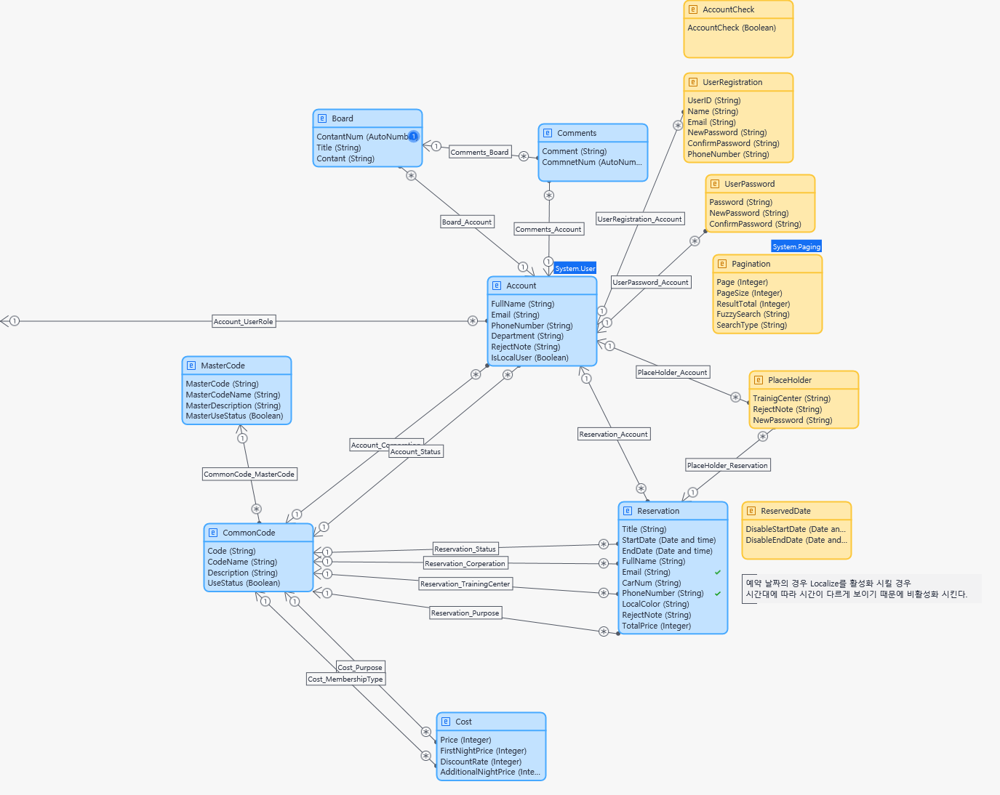

# Mendix - Healing House Project

## 목차
1. [Healing House 개요](#1-healing-house-개요)
2. [Domain Model](#2-domain-model)
3. [Page 설명](#3-page-설명)
4. [사용된 Module 및 Widget](#4-사용된-module-및-widget)
5. [개념 정리](#5-개념-정리)
6. [프로젝트 문제점 및 개선 방안](#6-프로젝트-문제점-및-개선-방안)


<br>

## 1. Healing House 개요

```
Mendix를 이용하여 개발된 예약 관리 시스템입니다.
```

<br>

## 2. Domain Model

```
Persistable Entity와 Non-Persistable Entity를 구분하여 각 Entity의 역할을 설명합니다.
```



- Persistable Entity(영속성)
  - Account(Generalization - System.User)
    - System.User를 일반화하여 사용자의 계정의 관련된 정보 데이터를 저장 및 관리합니다.
  - Board
    - 게시글 작성 시 필요한 데이터를 저장합니다.
  - Comments
    - 댓글에 대한 데이터를 관리합니다.
  - Reservation
    - 예약에 대한 데이터를 관리합니다.
  - Cost
    - 예약과 관련된 금액 정보를 관리합니다.
  - MasterCode, CommonCode
    - 마스터 코드와 하위 코드를 관리하기 위한 Entity입니다.
    - 각 기능별로 필요한 데이터에 대한 코드를 생성하여 관리할 수 있습니다.
    ```
    ex) MasterCode = C02(회원가입상태) 일 때 CommonCode = C0201(요청)
     ```

<br>

- Non-Persistable Entity(비영속성)
  - AccountCheck
    - 예약 신청 시 본인 확인을 위한 임시 데이터를 관리합니다.
    - 사용자가 Check Box를 선택하면 Boolean 값을 기준으로 현재 사용자의 정보를 확인 후 예약 정보에 입력될 수 있도록 활용합니다.
  - UserPassword
    - 비밀번호 초기화 시 초기화 된 비밀번호의 임시 데이터를 관리합니다.
    - 비밀번호 수정 시 새 비밀번호와 비밀번호 확인에 필요한 데이터를 관리합니다.
  - UserReservation
    - 회원가입 시 입력된 정보에 대한 임시 데이터를 관리합니다.
  - Pagination(Generalization - System.Paging)
    - Advanced Pagination 위젯 및 검색 기능에 필요한 Entity입니다.
    - 현재 페이지에 출력할 데이터의 수를 관리합니다.
  - ReservedDate
    - 이미 예약된 날짜를 새로운 예약 시 선택하지 못하도록 데이터를 관리하는 Entity입니다.
  - PlaceHolder
    - Email Connector 모듈에 필요한 Entity입니다.

<br>

## 3. Page 설명

```
각 Page별 기능에 대한 설명입니다.

권한
Administration(관리자), User(사용자), Anoymous(익명 사용자)
```

1. 로그인
   - `Anonymous`가 회원가입 및 로그인을 할 수 있습니다.<br><br>
2. 회원 관리
   - `Administration` 권한을 가진 사용자가 회원 삭제 및 수정(반려, 승인, 관리자취소)하여 회원을 관리 할 수 있습니다.<br><br>
3. 예약 신청
    - `Administration`, `User` 권한을 가진 사용자가 연수원을 예약할 수 있는 페이지입니다.
    - `ReservedDate`, `Cost` Entity를 활용하여 연수원, 이용 목적별로 예약할 수 있는 날짜를 선택하고, 선택한 날짜에 따른 총 금액과 예약 정보가 저장됩니다.
    - 예약 신청 시 관리자의 메일로 승인 요청 메일이 발송됩니다.<br><br>
4. 나의 예약
    - `Administration`, `User` 권한을 가진 사용자가 본인이 신청한 예약 정보 목록을 확인할 수 있습니다.
    - 예약 정보를 더블 클릭 시 해당 예약 정보를 출력하는 Popup Page에서 예약 신청을 취소할 수 있습니다.<br><br>
5. 예약 관리
    - `Administration` 권한을 가진 사용자가 전체 예약 목록을 확인할 수 있습니다.
    - 예약 정보를 더블 클릭 시 해당 예약 정보를 출력하는 Popup Page에서 반려, 승인, 관리자 취소를 할 수 있습니다.
    - 반려, 승인 시 해당 사용자의 메일로 발송됩니다.<br><br>
6. 비용 관리
    - `Administration` 권한을 가진 사용자가 이용 목적 및 회원 구분에 따른 최초 1박 가격, 할인율 등 비용에 관련 된 목록을 확인할 수 있습니다.<br><br>
7. 게시판
    - `Administration`, `User` 권한을 가진 사용자가 게시글 목록을 확인할 수 있습니다.
    - 게시글 및 댓글을 생성, 수정, 삭제 할 수 있습니다.
    - 게시글의 삭제는 해당 게시글을 작성한 사용자와 관리자만 가능합니다.
    - 게시글의 수정은 해당 게시글을 작성한 사용자만 가능합니다.
    - 댓글의 삭제는 해당 게시글을 작성한 사용자와 관리자만 가능합니다.<br><br>
8. 코드 관리
    - `MasterCode`와 `CommonCode`를 활용하여 목적에 따른 코드, 코드명 등 추가 및 수정 할 수 있습니다.
    - 저장된 코드는 각 기능에 따라 활용됩니다.

<br>

## 4. 사용된 Module 및 Widget

```
Healing House Project에 사용된 마켓플레이스 Module 및 Widget에 대한 설명입니다.
```

#### Widget
1. Advanced Date Picker
    - React Date Picker 라이브러리에서 사용 가능한 대부분의 사용자 정의 기능이 있는 Mendix 날짜 선택기입니다.
    - `Open to a specific date` 기능을 활용하여 예약 신청 시 `Reservation` 데이터에 따라 선택 가능한 날짜를 제어했습니다.<br><br>
2. Advanced Pagination
    - 서버 측 페이징을 수동으로 수행하는 데 필요한 계산 작업을 자동으로 처리하여 캡슐화하는 재사용 가능한 위젯입니다.
    - `data` 기능에서 `page`, `Result count`, `Page Size` 및 `Sizes`를 통해 회원 관리 페이지에서 현재 페이지에 몇 개의 데이터를 출력할 것인지 제어했습니다.<br><br>
3. HTML/JavaScript Snippet
    - HTML이나 JavaScript를 양식에 추가하거나 임의의 HTML 요소를 추가하여 스타일을 강화할 수 있습니다.
    - 로그인 버튼 설정 시 Enter 이벤트가 없기 때문에 해당 위젯을 사용하여 비밀번호 입력 후 Enter 키를 누르면 로그인 버튼을 클릭하는 기능을 구현했습니다.
    - 해당 위젯은 `Content Type`에 따라 설정이 가능하며, 본 프로젝트에서는 `JavaScript with JQuery`를 사용하여 기능을 구현했습니다.

#### Module
1. Email Connector
   - 자신의 이메일 서버에서 이메일을 보내고 받을 수 있습니다.<br><br>
2. Encryption
   - AES 알고리즘을 사용하여 일반 텍스트를 암호화하고 복호화합니다.
   - Email Connector 모듈을 사용하기 위한 필수 조건입니다.<br><br>
3. Mx Model Reflection
   - 앱에서 도메인 모델과 앱의 마이크로플로우에 대한 정보에 액세스할 수 있습니다.
   - Email Connector 모듈의 Email Template 기능에서 Domain Model의 Entity에 액세스하여 Email 전송 시 데이터를 활용합니다.<br><br>
4. CommunityCommons
   - 앱에 재사용 가능한 Java 메서드를 여러 개 추가하며, 이는 마이크로플로우나 사용자 정의 Java 작업에서 호출할 수 있습니다.
   - 해당 프로젝트에서 비밀번호 초기화 시 무작위의 비밀번호를 반환하기 위해 `RandomStrongPassword` 기능을 사용했습니다.

<br>

## 5. 개념 정리

```
프로젝트에서 사용했던 개념들을 설명합니다.
```
1. Domain Model
- Domain Model은 앱에서 사용하는 정보(또는 데이터)를 시각적으로 설명합니다.
- 관계형 데이터베이스 관리 시스템(RDBMS)의 구조를 추상화하는 데이터 모델입니다.
- Domain Model은 Associations으로 표현되는 다른 Entity와의 관계를 가진 Entity로 구성됩니다.<br><br>
2. Persistable(PE) vs Non-Persistable(NPE)
- Persistable
  - Entity가 Persistable로 선언되면 해당 Entity에 대한 데이터베이스 테이블이 생성됩니다.
- Non-Persistable
  - Non-Persistable는 런타임 메모리에 저장되고 데이터베이스에 커밋되지 않기 때문에 데이터베이스에 테이블이 없으며 해당 Entity를 검색하는 방법은 Association으로 검색할 수 있습니다.<br><br>
3. Generalization
- Generalization은 Mendix 도메인 모델의 일반화 개념으로 하나의 Entity가 다른 Entity로부터 속성과 연관 관계를 상속받는 개념이며, 객체 지향 프로그래밍의 상속과 유사합니다.<br><br>
4. Associations
- Entity 간의 관계를 설명하며, 도메인 모델에서 Associations는 두 Entity간의 선이나 화살표로 표현됩니다.
- 연관의 다수성(또는 참조되는 객체의 수)은 연관의 양쪽에 숫자 `1` 또는 별표 `*`로 표시됩니다.
- Persistable Entity와 Non-Persistable Entity간의 연결은 Non-Persistable Entity에서 시작해야 하며 소유자는 Default여야 합니다.
- Associations에는 `One-to-One Association(일대일)`, `One-to-Many Association(일대다)`, `Reference Set(다대다)` 관계가 있습니다.
  - One-to-One Association(1-1)
    - 두 객체가 서로에게만 연관될 수 있고 동시에 다른 객체에는 연관될 수 없는 관계입니다.
  - One-to-Many Association(1-*)
    - 가장 일반적으로 사용되는 연관성으로 하나의 객체가 여러 객체와 연관될 수 있는 가장 일반적인 관계입니다.
  - Reference Set(\*-*)
    - 여러 객체가 여러 객체와 연관될 수 있는 관계입니다.<br><br>
5. 권한 관리
- User Roles
  - 사용자 역할은 데이터, 양식 및 마이크로플로우에 대한 여러 액세스 권한을 집계합니다.
  - 모든 사용자 역할에는 하나 이상의 모듈 역할이 있으며, 해당 사용자 역할이 있는 사용자가 해당 모듈 역할에 대해 정의된 모든 액세스 권한을 갖는다는 것을 의미합니다.
  - 일반적인 사용자 역할에는 `System.User` 모듈 역할과 최소한 하나의 다른 모듈 역할이 있습니다.
  - App Security > User roles 탭을 열면 사용자 역할에 액세스할 수 있습니다.<br><br>
- Module Role
  - 모듈 역할은 모듈 내에서 액세스 권한 집합을 정의하기 위해 만드는 특정 역할이며, 권한은 모듈 내에 포함됩니다.
  - App Security > User roles 탭에서 사용자 역할에 여러 모듈 역할을 할당할 수 있습니다.
  - 모듈 역할에는 `Page access`, `Microflow access`, `Nanoflow access`, `Entity access`, `OData/GraphQL access`, `REST access`, `Data Set access`가 포함됩니다.<br><br>
6. Microflows vs Nanoflows
- Microflows와 Nanoflows를 사용하면 애플리케이션의 논리를 표현할 수 있습니다.
- 객체 생성 및 업데이트, 페이지 표시, 선택과 같은 작업을 수행할 수 있습니다.
- 전통적으로 텍스트 프로그램 코드로 끝나는 것을 시각적으로 표현하는 방법입니다.
  - 프로그래밍에서 애플리케이션의 논리를 코드로 작성하던 방식을 Microflows와 Nanoflows가 시각적 모델링으로 대체됩니다.
- Microflows
  - 런타임 서버에서 실행되므로 오프라인 앱에서 사용할 수 없습니다.
  - 애플리케이션 서버에서 실행되며 보다 고급 데이터베이스 기능에 액세스할 수 있습니다.
  - Java 라이브러리를 사용합니다.
- Nanoflows
  - 클라이언트 측(즉, 브라우저/기기)에서 직접 실행되며 오프라인 앱에서 사용할 수 있으며 대부분의 동작이 기기에서 직접 실행되므로 서버에 액세스할 필요가 없는 로직에 대한 속도 이점이 있습니다.
  - 트랜잭션 내부에서 실행되지 않으므로 오류가 발생하더라고 이전 변경 사항을 롤백하지 않습니다.
  - JavaScript 라이브러리를 사용합니다.
  - 연결이 필요 없는 논리에서 사용 가능합니다. 즉, 데이터베이스에 상호 작용하는 `Create`, `Commit`, `Retrieve`, `Rollback`와 같은 동작이 포함되지 않은 온라인 애플리케이션에서는 Nanoflows를 사용하는 것이 가장 좋은 방법입니다.<br><br>
7. XPath vs Expressions
- XPath
  - 데이터를 검색하도록 설계된 Mendix 쿼리 언어 중 하나입니다.
  - 경로 표현식을 사용하여 Mendix 객체와 해당 속성 또는 연결의 데이터를 선택합니다.
  - 데이터베이스 또는 객체 간 관계에서 필요한 데이터를 효율적으로 검색하는데 사용됩니다.
- Expressions
  - 표현식은 함수나 함수의 조합에 따라 값을 변경합니다.
  - 명명된 항목(예: 객체, 목록 또는 변수)은 항목 이름을 삽입하고 달러 기호를 추가하여 표현식에서 호출할 수 있습니다.
    - 예) `$customer` - `customer`라는 객체를 참조할 수 있음.
  - 정규 표현식, 단항 표현식, 산술 표현식, 관계식, 수학적 함수 호출 등 다양한 표현식과 함수를 지원합니다.<br><br>
8. Validation Rules
- Validation Rules(검증 규칙)은 객체가 커밋되기 전에 충족되어야 하는 조건입니다.
- 검증 규칙에 정의된 조건이 객체가 커밋될 때 충족되지 않으면 런타임 서버는 검증 오류를 생성합니다.
- 규칙의 속성에는 `Required(default)`, `Unique`, `Equals`, `Range`, `Regular expression`, `Maximum length`가 있습니다.<br><br>
9. Localize(현지화)
- Localize는 Entity의 `Date and Time` 타입의 속성으로 값을 표시(또는 선택)할 때 날짜와 시간을 현지화해야 하는지 여부를 나타냅니다.
- 기본적으로 Localize가 활성화되어 있으며, 날짜의 시간 구성 요소가 중요하지 않거나, 전 세계적으로 날짜를 정확히 동일하게 하려는 경우 이 속성을 비활성화할 수 있습니다.
  - 예) 생일, 예약일 등이 있습니다.
- 비활성화 시 값은 UTC로 저장 및 표시됩니다.

<br>

## 6. 프로젝트 문제점 및 개선 방안

1. 검색 기능
- 문제점
  - 정규 표현식을 활용하여 이름, 전화번호, Email을 각각 분류하여 검색할 수 있으나 정확하지 않은 값으로는 검색이 되지 않는다.
  - 예를 들어, `test@email.com`이라는 메일이 있을 때 `test`만 작성 시 검색이 되지 않거나 이름으로 분류되어 검색된다.
  - Keyword 없는 항목에 대해서 검색 결과를 출력하지 못합니다.<br><br>
- 개선 방안
  - 정규 표현식을 활용하여 데이터를 분류하지 않고, 전체 데이터를 검색 후 중복된 값을 제거하여 목록을 출력할 수 있도록 수정할 계획입니다.<br><br>
2. Domain Model에서 불필요한 Association
- 문제점
  - `Reservation`과 `Cost` Entity를 1대다의 Association을 맺었으나, 예약 시 총 금액을 계산할 때 `Cost` Entity의 데이터를 가져와 계산한 값을 `Reservation` Entity의 `TotalPrice` 속성에 저장하면 되기 때문에 해당 Association은 불필요합니다.<br><br>
- 개선 방안
  - Association을 제거하고, TotalPrice 속성에 계산된 값을 저장하는 Microflow를 생성 및 수정할 계획입니다.<br><br>
3. 페이지 이동 간 객체 관리
- 문제점
  - 페이지 이동 시 객체 관리가 제대로 이루어지지않는 문제점이 발생합니다.
  - 예를 들어, 댓글을 작성한 후 뒤로 가기 버튼을 클릭하면, 이전 댓글 객체가 그대로 유지되어 새로운 댓글이 생성되지 않고 기존 댓글이 변경되는 문제입니다.<br><br>
- 개선 방안
  - 기존 대부분의 Microflow에서 페이지 이동 시 `Show Page` 또는 `Close Page` 기능을 하나씩만 사용했으나, 두 기능을 적절한 위치에 같이 사용하여 페이지 스택에 남아있는 데이터를 관리할 수 있도록 수정할 계획입니다.